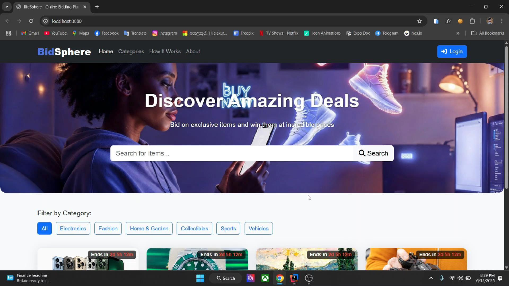

# Distributed Online Auction System (Java EE + JMS)

## 🎯 Project Overview
This project is a **Java EE-based Distributed Online Auction System** built using **Enterprise JavaBeans (EJB)** and **Java Message Service (JMS)**. It was developed as part of my academic journey to explore enterprise application architecture, asynchronous communication, and real-time system design.

The system enables users to:
- View products
- Place manual or auto bids
- Participate in real-time bidding with automated bid updates

Backed by **Message-Driven Beans (MDB)** and **Singleton Session Beans**, this project simulates high-concurrency auction environments using **JMS Topics** for asynchronous processing and **WebSocket** for real-time updates.

---

## ⚙️ Technologies Used
- **Java EE** (Jakarta EE)
- **Payara Server (OpenMQ embedded)**
- **Enterprise JavaBeans (EJB)**
  - Stateless Session Beans
  - Singleton Session Bean
  - Message-Driven Beans
- **Java Messaging Service (JMS)**
- **WebSocket (for real-time updates)**
- **HTML, CSS, JavaScript (for test UI)**

---

## 📦 Modules
The application is structured as a **Java EE EAR** project with three modules:
- **Core Module** – Entity and DTO classes
- **EJB Module** – Business logic (bidding, user, product, auto-bid)
- **Web Module** – Servlet endpoints, WebSocket server, static frontend

---

## 🧠 Key Features
- **Real-time bidding system** with live updates via WebSocket
- **Auto-bidding logic**: Users can set a max bid, and the system auto-bids when outbid
- **In-memory datastore** using a Singleton EJB for products and users
- **JMS integration** for decoupled and scalable message processing
- **Concurrency-handling** tested with tools like JMeter

---

## 📸 User Interface Preview

> *Click the image below to watch the full walkthrough video.*

> You can also view sample UI screens in the [`/images`](./images) folder of this repo.

---
